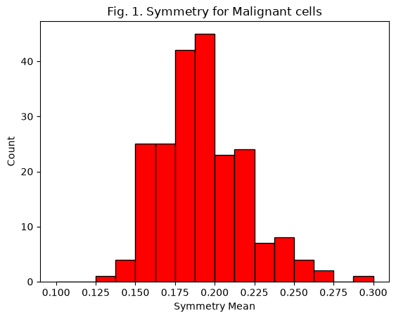
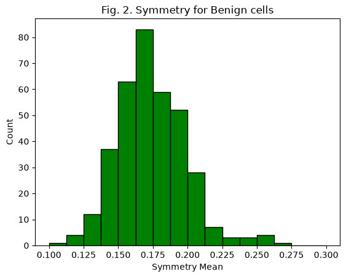
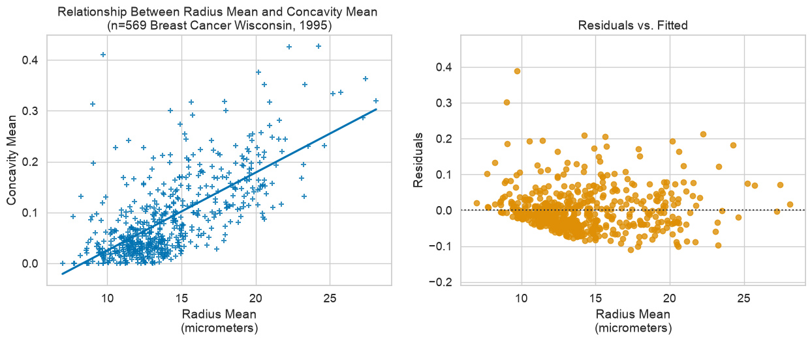

# Breast cancer cell statistics

Two statistical analyses of the Breast Cancer Wisconsin (Diagnostic) dataset: 569 biopsies, each described by measurements of the cell nuclei, labelled malignant (212) or benign (357).

## 1. Do malignant tumors differ in cell symmetry?

[`01_inference_symmetry.ipynb`](01_inference_symmetry.ipynb)

Compares mean cell symmetry between malignant and benign tumors with a two-sample t-test, a 95% confidence interval and Cohen's d. The descriptive statistics (mean, median, mode, standard deviation, range) are implemented from scratch rather than taken from a library.

| | Malignant | Benign |
| :--- | :---: | :---: |
| Count | 212 | 357 |
| Mean symmetry | 0.1929 | 0.1742 |
| Standard deviation | 0.0276 | 0.0248 |

| Result | Value |
| :--- | :--- |
| Difference in means | 0.0187 |
| t statistic | 8.34 (p = 5.7 × 10⁻¹⁶) |
| 95% confidence interval | [0.0142, 0.0233] |
| Cohen's d | 0.72 (medium) |

Malignant tumors have a higher mean symmetry value, and the difference is statistically significant with a medium effect size.

| | |
| :---: | :---: |
|  |  |

## 2. How well does tumor radius predict concavity?

[`02_regression_radius_concavity.ipynb`](02_regression_radius_concavity.ipynb)

Fits a simple linear regression of mean concavity on mean radius, then checks the model's assumptions with a residuals-vs-fitted plot, a residual histogram and a normal Q–Q plot.

| Result | Value |
| :--- | :--- |
| Pearson's r | 0.677 |
| R² | 0.458 |
| Regression line | concavity = 0.0153 × radius − 0.1275 |
| Slope, 95% confidence interval | [0.014, 0.017] (p = 1.9 × 10⁻⁷⁷) |

Radius explains about 46% of the variation in concavity. The slope is clearly non-zero, but the residuals are right-skewed: concavity cannot go below zero, which puts a hard lower edge on the residuals while a few tumors sit far above the line. The normality assumption therefore does not fully hold.



## Run it

```sh
pip install -r requirements.txt
jupyter notebook
```

## Data

`data/breast-cancer-wisconsin.csv` is the Breast Cancer Wisconsin (Diagnostic) dataset: Wolberg, W., Mangasarian, O., Street, N., & Street, W. (1995), UCI Machine Learning Repository, https://doi.org/10.24432/C5DW2B.

## Background

Written for formal analysis courses at Minerva University (fall 2025 and spring 2026). The notebooks started from a course template, and the regression plotting helper follows the template's structure; the analysis, statistics functions and interpretation are my own.
